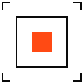
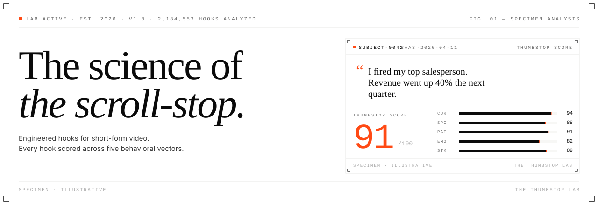

<div align="center">



# The Thumbstop Lab

### _The science of the scroll-stop._

Engineered hooks for short-form video. Every hook scored across five behavioral vectors — before it ever reaches a feed.

<br/>

[](https://nextjs.org)
[](https://www.typescriptlang.org)
[](https://tailwindcss.com)
[](https://motion.dev)


<br/>

**[Live site](#) · [About](#about) · [The five vectors](#the-five-behavioral-vectors) · [Tech stack](#tech-stack) · [Structure](#project-structure) · [Quickstart](#quickstart)**

</div>

<br/>

<div align="center">
  
</div>

<br/>

## About

**Thumbstop** is engineered-hook infrastructure for content agencies and creator teams shipping short-form video at volume. The engine generates hook candidates and scores each across five behavioral vectors — **Curiosity**, **Specificity**, **Pattern Interrupt**, **Emotion**, and **Stakes** — calibrated against a corpus of short-form videos with labeled retention outcomes.

This repository contains the public **landing page** for The Thumbstop Lab. The application itself ships separately.

> The Thumbstop Score is a 0–100 composite measure of a hook's likelihood of halting a scroll within the first 0.8 seconds of exposure.

<br/>

## The five behavioral vectors

| # | Vector | What it measures | Typical range |
|---|--------|------------------|---------------|
| `01` | **Curiosity Gap** | The knowable unknown — a viewer-felt question within reach of an answer | `40–95` |
| `02` | **Specificity** | Numbers, names, stakes. Precision at speed creates credibility at speed | `30–98` |
| `03` | **Pattern Interrupt** | A break from expected visual, verbal, or structural rhythm | `35–92` |
| `04` | **Emotional Charge** | Arousal drives retention — shock, delight, outrage, relief | `20–96` |
| `05` | **Stakes** | What's lost or gained. Consequence anchors the watch | `25–94` |

<br/>

## Tech stack

| Layer | Tool |
|-------|------|
| Framework | [Next.js 16](https://nextjs.org) · App Router · [Turbopack](https://turbo.build/pack) |
| Language | [TypeScript 5](https://www.typescriptlang.org) |
| Styling | [Tailwind CSS v4](https://tailwindcss.com) with CSS-variable design tokens |
| Display type | [Instrument Serif](https://fonts.google.com/specimen/Instrument+Serif) |
| UI type | [Geist Sans](https://vercel.com/font) |
| Data type | [Geist Mono](https://vercel.com/font) |
| Motion | [Framer Motion 12](https://motion.dev) with `prefers-reduced-motion` |
| Icons | [Lucide](https://lucide.dev) + custom SVG line-art |
| Deployment | [Vercel](https://vercel.com) — static/edge |

<br/>

## Project structure

```
the-thumbstop-lab/
├── .github/
│   ├── banner.svg          # Repo hero banner
│   └── logo.svg            # Lab-mark logo
├── app/
│   ├── globals.css         # Tailwind v4 theme, tokens, keyframes, a11y
│   ├── icon.svg            # Brand favicon
│   ├── layout.tsx          # Fonts + metadata + root shell
│   └── page.tsx            # Composes the landing page
├── components/
│   ├── anatomy.tsx         # §1 — Five-vector breakdown
│   ├── method.tsx          # §2 — Three-step protocol
│   ├── library.tsx         # §3 — Specimen strip
│   ├── research.tsx        # §4 — FAQ as lab notes
│   ├── hero.tsx            # Hero with staggered load animations
│   ├── nav.tsx             # Sticky anchor navigation
│   ├── stats-band.tsx      # Count-up-on-scroll telemetry
│   ├── cta-band.tsx
│   ├── footer.tsx
│   ├── thumbstop-score-card.tsx     # Signature score visual (animated)
│   ├── hook-specimen-card.tsx       # Compact card for the strip
│   ├── hook-library-strip.tsx       # Auto-scrolling marquee
│   ├── notebook-entry.tsx           # Expandable research note
│   ├── scroll-progress.tsx          # Progress bar under the nav
│   ├── section-header.tsx           # § numbering + serif heading
│   ├── pulsing-dot.tsx              # Live-lab indicator
│   ├── count-up-number.tsx          # Scroll-triggered counter
│   └── vector-icons.tsx             # Line-art per vector
└── lib/
    ├── vectors.ts          # Five behavioral vectors
    ├── hooks-data.ts       # Curated hook specimens
    └── faq-data.ts         # Research notes
```

<br/>

## Design principles

- **No dark theme.** Pure white (`#FFFFFF`) primary, off-white (`#F7F7F5`) cards.
- **Sharp corners.** `0–2px` border radius, maximum.
- **No gradients.** Solid colors only.
- **Hot signal orange** (`#FF4A14`) used sparingly — CTAs, score numerals, live dots.
- **Hairline borders** (`#E8E8E6` at `1px`) create a technical-publication density.
- **§ section numbering** for a lab-publication feel.
- **Monospace for all metadata, numbers, and labels.**
- **Editorial serif** for display type, paired with crisp UI and data sans/mono.
- **`prefers-reduced-motion` honored** across every animation.

<br/>

## Quickstart

```bash
# Clone
git clone https://github.com/pradhankukiran/the-thumbstop-lab.git
cd the-thumbstop-lab

# Install
npm install

# Dev
npm run dev

# Build
npm run build

# Lint
npm run lint
```

Open [http://localhost:3000](http://localhost:3000).

<br/>

## Scripts

| Script | What it does |
|--------|--------------|
| `npm run dev` | Start the Next.js dev server with Turbopack |
| `npm run build` | Create an optimized production build |
| `npm run start` | Run the production build |
| `npm run lint` | Lint via ESLint + `eslint-config-next` |

<br/>

## Roadmap

- [x] Landing page — hero, anatomy, method, library, research, CTA, footer
- [x] Signature score-card component with load-time animation
- [x] Auto-scrolling specimen strip with hover-pause
- [x] Count-up telemetry on scroll
- [x] Reduced-motion support throughout
- [x] Lab-mark favicon + SVG banner
- [ ] Real hook-generation engine behind **Launch app**
- [ ] Waitlist / intake form
- [ ] Public hook catalog
- [ ] `sitemap.xml` + `robots.txt` + OG image
- [ ] Analytics + error monitoring
- [ ] Automated tests + CI

<br/>

## Notation

The Thumbstop Score is a weighted aggregate across five vectors, calibrated per niche:

```
T(score) = Σ wᵢ · vᵢ · niche_kernel(ω)    where i ∈ {cur, spc, pat, emo, stk}
```

<br/>

## License

[MIT](LICENSE) · © 2026 The Thumbstop Lab

---

<div align="center">
  <sub>Engineered for short-form. All specimens illustrative.</sub>
</div>
